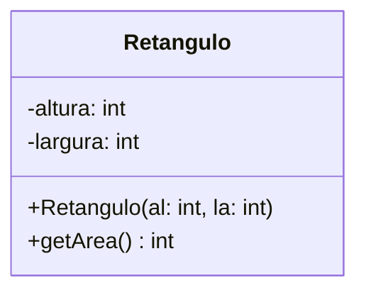
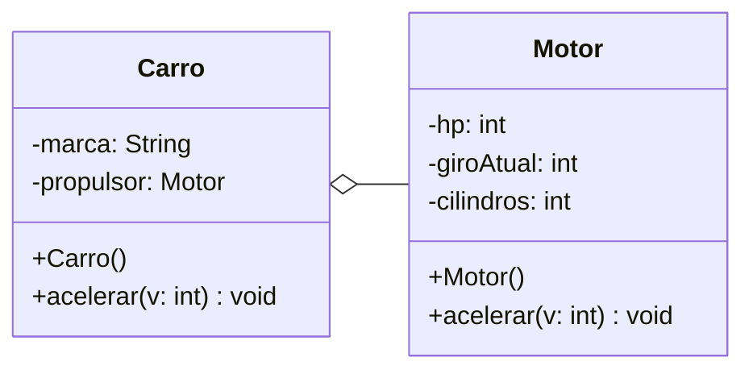

# Diagrama de classes UML

## Código Java

```java
public class Retangulo {
    private int altura;
    private int largura;

    public Retangulo(int al, int la){
        this.altura = al;
        this.largura = la;
    }

    public int getArea(){
        int area = al * la;
        return area;
    }
}
```

 ## Diagrama UML (exemplos)


### Exemplo 1



### Exemplo 2

