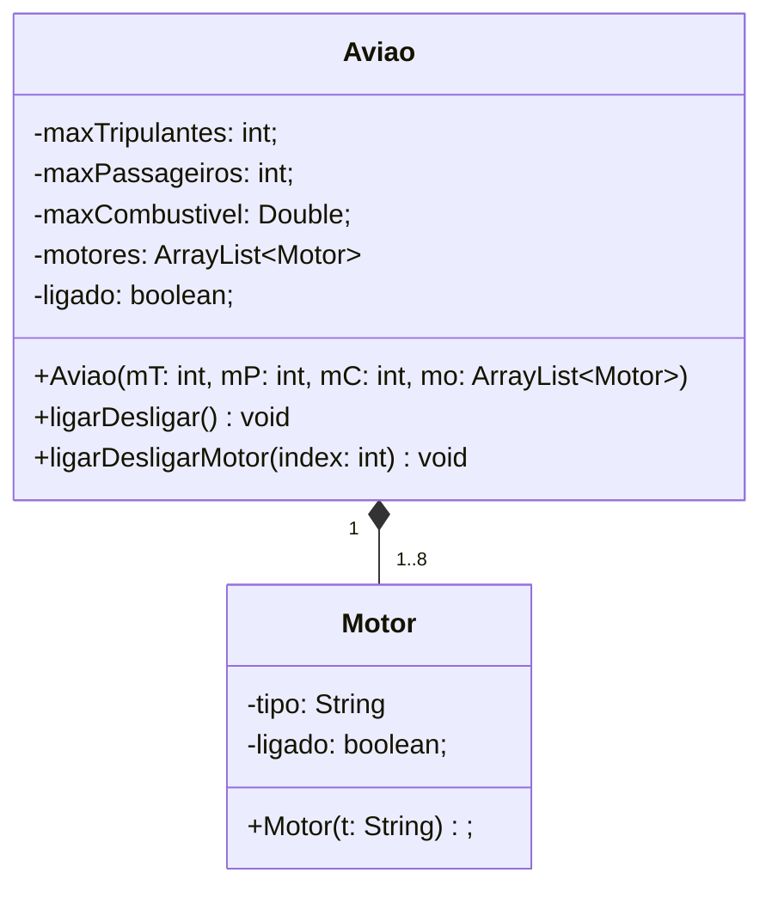

# Diagrama UML

```mermaid
classDiagram

class Aviao {
    -maxTripulantes: int;
    -maxPassageiros: int;
    -maxCombustivel: Double;
    -motores: ArrayList~Motor~
    -ligado: boolean;
    +Aviao(mT: int, mP: int, mC: int, mo: ArrayList~Motor~)
    +ligarDesligar() void
    +ligarDesligarMotor(index: int) void
}

class Motor {
    -tipo: String
    -ligado: boolean;
    +Motor(t: String);
}

Aviao "1" *-- "1..8" Motor

```