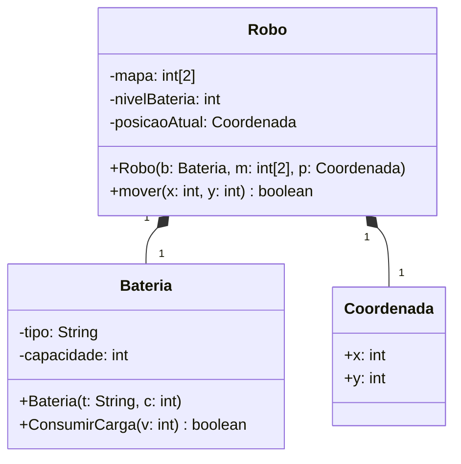

# Diagrama UML

```mermaid
classDiagram
    class Robo {
        -mapa: int[2]
        -nivelBateria: int
        -posicaoAtual: Coordenada
        +Robo(b: Bateria, m: int[2], p: Coordenada)
        +mover(x: int, y: int) boolean
    }

    class Coordenada {
        +x: int
        +y: int
    }

    class Bateria {
        -tipo: String
        -capacidade: int
        +Bateria(t: String, c: int)
        +ConsumirCarga(v: int) boolean
    }

    Robo "1" *-- "1" Bateria
    Robo "1" *-- "1" Coordenada

```