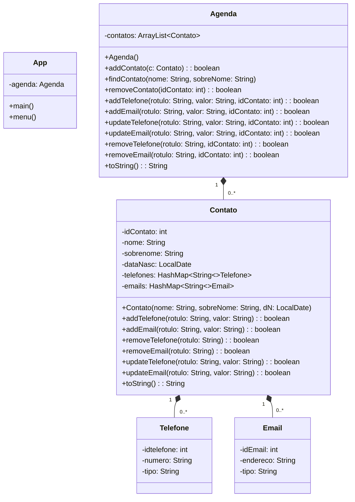

# Agenda UML

```mermaid
classDiagram

class App{
    -agenda: Agenda
    +main()
    +menu()
}

class Agenda {
    -contatos: ArrayList~Contato~
    +Agenda()
    +addContato(c: Contato): boolean
    +findContato(nome: String, sobreNome: String)
    +removeContato(idContato: int): boolean
    +addTelefone(rotulo: String, valor: String, idContato: int): boolean
    +addEmail(rotulo: String, valor: String, idContato: int): boolean
    +updateTelefone(rotulo: String, valor: String, idContato: int): boolean
    +updateEmail(rotulo: String, valor: String, idContato: int): boolean
    +removeTelefone(rotulo: String, idContato: int): boolean
    +removeEmail(rotulo: String, idContato: int): boolean
    +toString(): String
}

class Contato {
    -idContato: int
    -nome: String
    -sobrenome: String
    -dataNasc: LocalDate
    -telefones: HashMap~String~~Telefone~
    -emails: HashMap~String~~Email~
    +Contato(nome: String, sobreNome: String, dN: LocalDate)
    +addTelefone(rotulo: String, valor: String): boolean
    +addEmail(rotulo: String, valor: String): boolean
    +removeTelefone(rotulo: String): boolean
    +removeEmail(rotulo: String): boolean
    +updateTelefone(rotulo: String, valor: String): boolean
    +updateEmail(rotulo: String, valor: String): boolean
    +toString(): String
}

class Telefone {
    -idtelefone: int
    -numero: String
    -tipo: String
}

class Email {
    -idEmail: int
    -endereco: String
    -tipo: String
}

Agenda "1" *-- "0..*" Contato
Contato "1" *-- "0..*" Telefone
Contato "1" *-- "0..*" Email
```