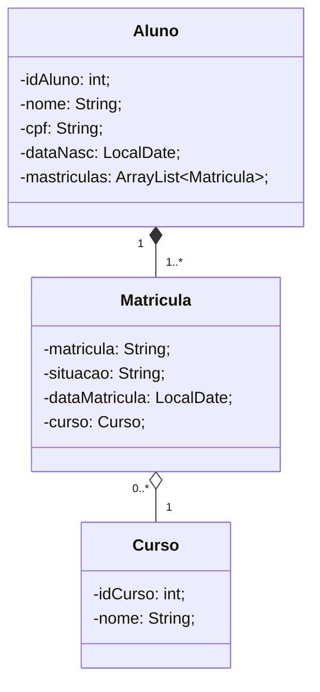

# Aluno UML

```mermaid
classDiagram

class Aluno {
    -idAluno: int;
    -nome: String;
    -cpf: String;
    -dataNasc: LocalDate;
    -mastriculas: ArrayList~Matricula~;
}

class Matricula {
    -matricula: String;
    -situacao: String;
    -dataMatricula: LocalDate;
    -curso: Curso;
}

class Curso {
    -idCurso: int;
    -nome: String;
}

Aluno "1" *-- "1..*" Matricula
Matricula "0..*" o-- "1" Curso
```