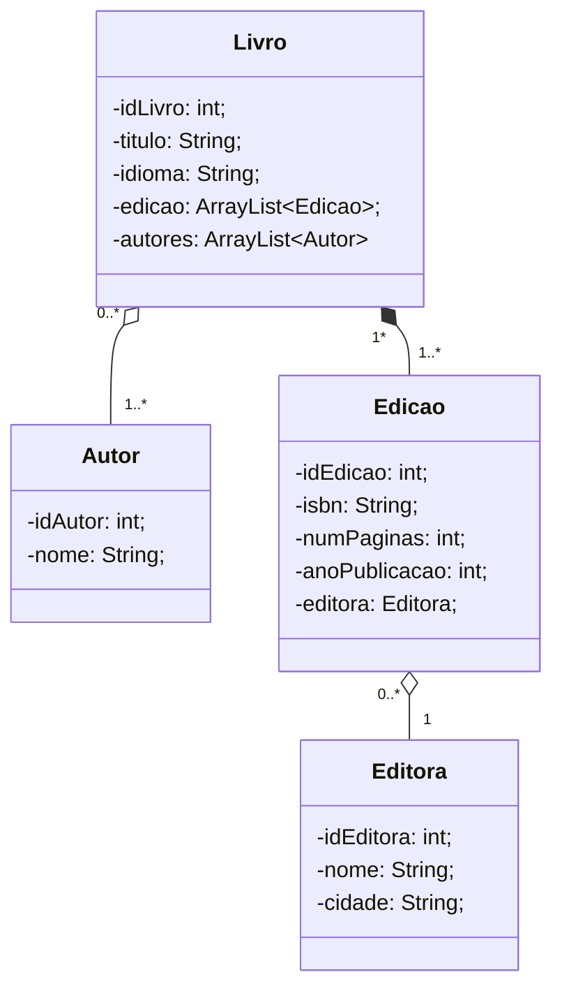

# Livro UML

```mermaid
classDiagram

class Livro {
    -idLivro: int;
    -titulo: String;
    -idioma: String;
    -edicao: ArrayList~Edicao~;
    -autores: ArrayList~Autor~
}

class Autor {
    -idAutor: int;
    -nome: String;
}

class Edicao {
    -idEdicao: int;
    -isbn: String;
    -numPaginas: int;
    -anoPublicacao: int;
    -editora: Editora;
}

class Editora {
    -idEditora: int;
    -nome: String;
    -cidade: String;
}

Livro "0..*" o-- "1..*" Autor
Livro "1*" *-- "1..*" Edicao
Edicao "0..*" o-- "1" Editora

```