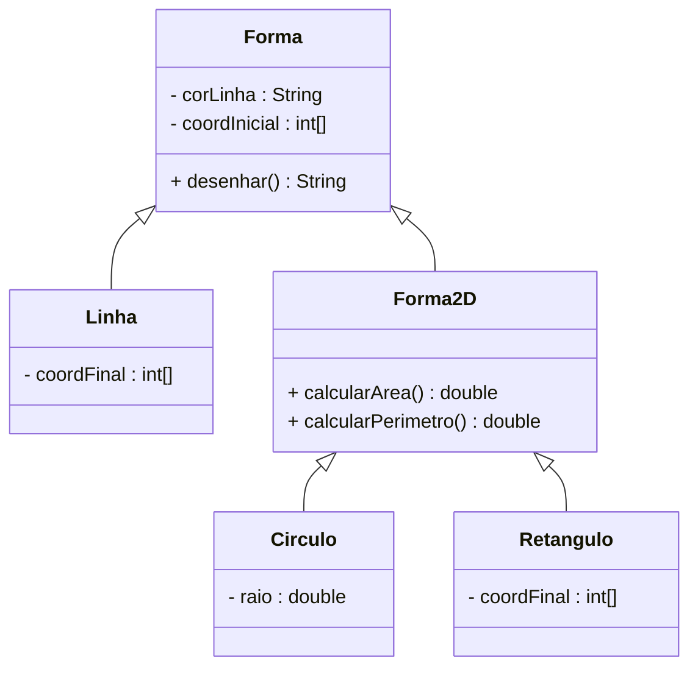

```mermaid
classDiagram
    direction BT

class Forma {
    - corLinha : String
    - coordInicial : int[]
    + desenhar() String
}

class Forma2D {
    + calcularArea() double
    + calcularPerimetro() double

}

class Linha {
    - coordFinal : int[]
}

class Circulo {
    - raio : double
}

class Retangulo {
    - coordFinal : int[]
}

Linha --|> Forma
Forma2D --|> Forma
Circulo --|> Forma2D
Retangulo --|> Forma2D
```