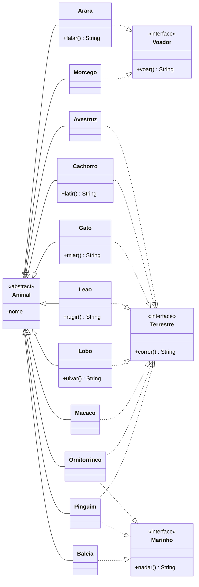

```mermaid
classDiagram
    
    direction LR

    class Animal {
    <<abstract>>
        -nome
    }

    class Arara {
        +falar() String
    }

    class Avestruz
    class Baleia

    class Cachorro {
        +latir() String
    }

    class Gato {
        +miar() String
    }

    class Leao {
        +rugir() String
    }

    class Lobo {
        +uivar() String
    }
    class Macaco
    class Morcego
    class Pinguim
    class Ornitorrinco

    class Voador {
        <<interface>>
        +voar() String
    }

    class Terrestre {
        <<interface>>
        +correr() String
    }

    class Marinho {
        <<interface>>
        +nadar() String
    }

    Animal <|-- Arara
    Animal <|-- Morcego
    Animal <|-- Avestruz
    Animal <|-- Cachorro
    Animal <|-- Gato
    Animal <|-- Leao
    Animal <|-- Lobo
    Animal <|-- Macaco
    Animal <|-- Baleia
    Animal <|-- Pinguim
    Animal <|-- Ornitorrinco

    Arara ..|> Voador
    Morcego ..|> Voador

    Avestruz ..|> Terrestre
    Cachorro ..|> Terrestre
    Gato ..|> Terrestre
    Leao ..|> Terrestre
    Lobo ..|> Terrestre
    Macaco ..|> Terrestre
    Ornitorrinco ..|> Terrestre
    Pinguim ..|> Terrestre
    
    Ornitorrinco ..|> Marinho
    Pinguim ..|> Marinho
    Baleia ..|> Marinho
    
    
```