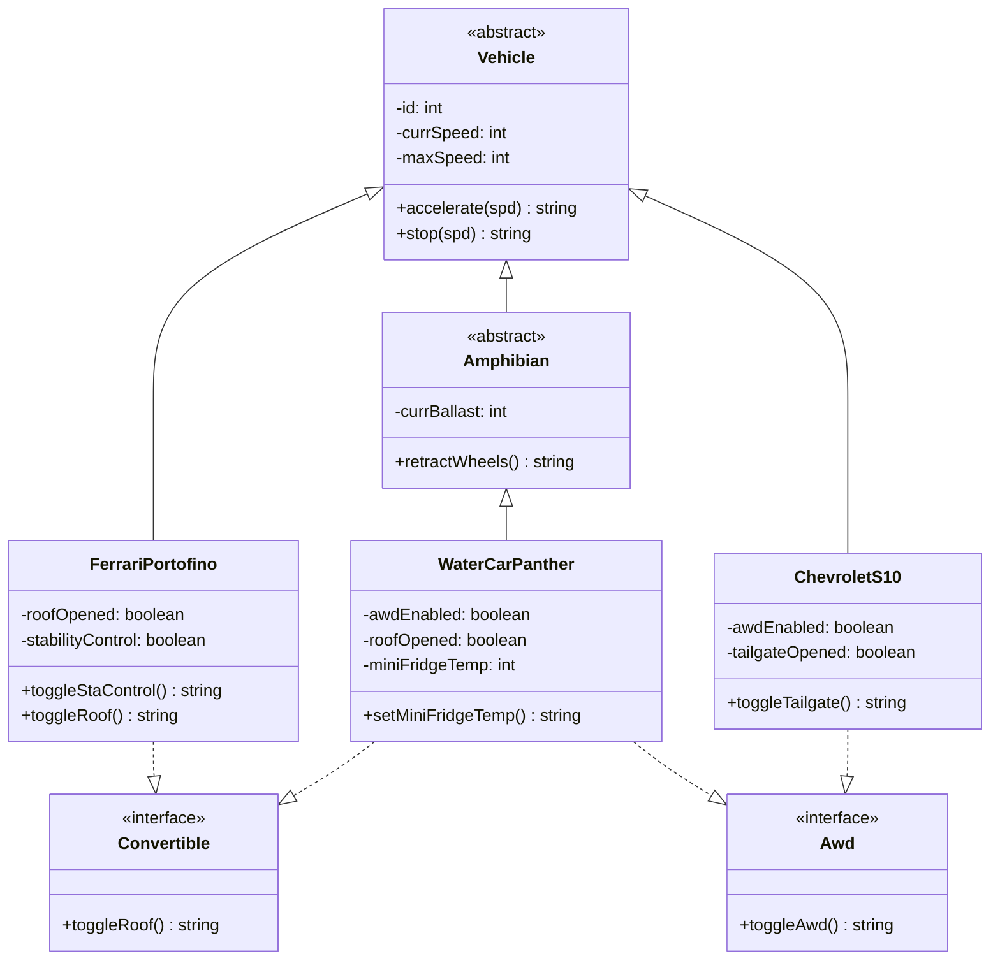

```mermaid
classDiagram
    
    class Vehicle {
        <<abstract>>
        -id: int
        -currSpeed: int
        -maxSpeed: int
        +accelerate(spd) string
        +stop(spd) string
    }

    class Amphibian {
        <<abstract>>
        -currBallast: int
        +retractWheels() string
    }

    class FerrariPortofino {
        -roofOpened: boolean
        -stabilityControl: boolean
        +toggleStaControl() string
        +toggleRoof() string
    }

    class WaterCarPanther {
        -awdEnabled: boolean
        -roofOpened: boolean
        -miniFridgeTemp: int
        +setMiniFridgeTemp() string
    }

    class ChevroletS10 {
        -awdEnabled: boolean
        -tailgateOpened: boolean
        +toggleTailgate() string
    }

    class Awd {
        <<interface>>
        +toggleAwd() string
    }

    class Convertible {
        <<interface>>
        +toggleRoof() string
    }

    Vehicle <|-- FerrariPortofino
    Vehicle <|-- Amphibian
    Vehicle <|-- ChevroletS10
    Amphibian <|-- WaterCarPanther
    FerrariPortofino ..|> Convertible
    WaterCarPanther ..|> Convertible
    ChevroletS10 ..|> Awd
    WaterCarPanther ..|> Awd


```