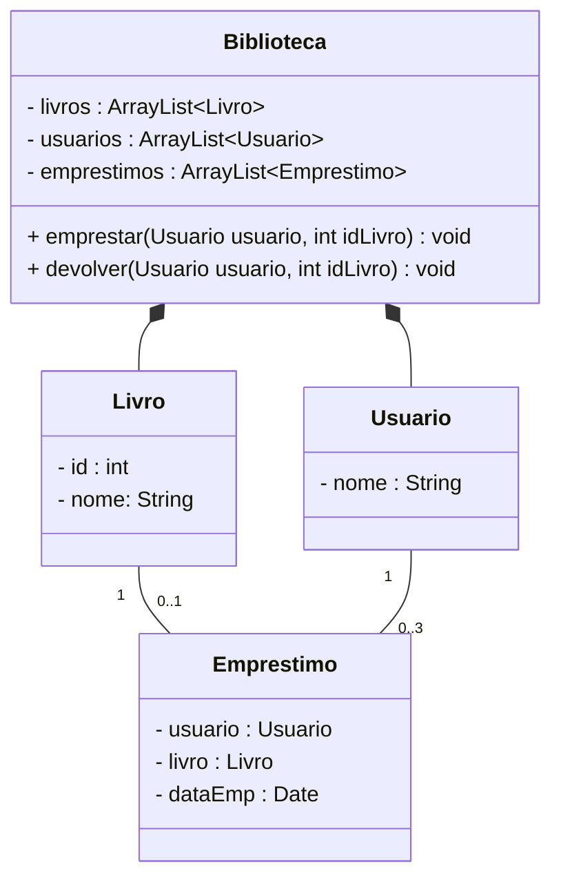

```mermaid
classDiagram
    direction BT

class Biblioteca {
    - livros : ArrayList~Livro~
    - usuarios : ArrayList~Usuario~
    - emprestimos : ArrayList~Emprestimo~
    + emprestar(Usuario usuario, int idLivro) void
    + devolver(Usuario usuario, int idLivro) void
}

class Livro{
    - id : int
    - nome: String
}

class Emprestimo {
    - usuario : Usuario
    - livro : Livro
    - dataEmp : Date
}

class Usuario {
    - nome : String
}

Livro --* Biblioteca
Usuario --* Biblioteca
Emprestimo "0..1" -- "1" Livro
Emprestimo "0..3" -- "1" Usuario
```
